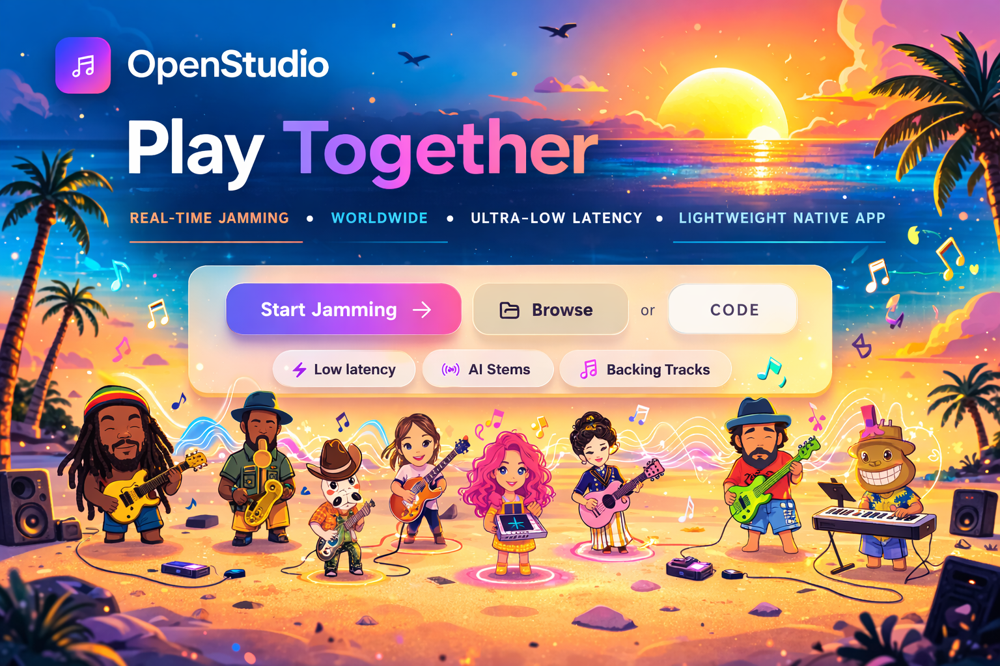

<div align="center">
  

  <h1>OpenStudio</h1>

  <h3>The online rehearsal room for musicians</h3>

  <p>
    Play together in real time, share a room link, run synced backing tracks, shape your sound with effects,
    and keep the session moving without turning setup into a project.
  </p>

  <p>
    <a href="https://openstudio.cafe"><strong>Open OpenStudio</strong></a>
    ·
    <a href="https://openstudio.cafe"><strong>openstudio.cafe</strong></a>
    ·
    <a href="https://github.com/openstudio-cafe/openstudio/discussions"><strong>Community</strong></a>
    ·
    <a href="./docs"><strong>Docs</strong></a>
  </p>

</div>

OpenStudio is a browser-based collaborative music studio built for real rehearsals, writing sessions, lessons, and online jams. The easiest way to use it is the hosted app at [openstudio.cafe](https://openstudio.cafe).

If you want to make music with it, start there. If you want to self-host it or contribute to the codebase, this repository has what you need below.

## Start At openstudio.cafe

The recommended way to use OpenStudio is the live app:

1. Go to [openstudio.cafe](https://openstudio.cafe).
2. Create a room or join one with a room code.
3. Join as a performer if you want to send audio, or as a listener if you just want to hear the room.
4. Put on wired headphones, pick your input, and start playing.

That path gets you into a session fastest, with no local setup and no self-hosting work.

## Why Musicians Use It

- Real-time online rooms for rehearsals, songwriting, remote practice, and casual jams.
- Low-latency audio in the browser, with an optional native bridge for lower hardware latency on supported setups.
- Synced backing tracks so everyone hears the same arrangement at the same time.
- Effects, mixing controls, loops, and performance tools in one shared room.
- AI-assisted features like stem separation and music generation where those services are enabled.
- Listener mode for collaborators, students, producers, or friends who want to hear the session without performing.

## Best Results For Live Playing

- Use wired headphones to avoid speaker bleed and echo.
- Use wired internet when possible. Wi-Fi jitter is usually the first thing that hurts a session.
- An audio interface helps, especially if you want the best monitoring feel.
- Use a current Chromium-based browser or Firefox with microphone permissions enabled.
- Close extra apps that may take over your audio device or add CPU load.

## What You Can Do In A Room

- Create a room and invite people with a link or room code.
- Join as a performer or a listener.
- Run backing tracks and keep playback in sync across the room.
- Shape your sound with built-in effects.
- Use loops and musical tools to sketch ideas quickly.
- Build a lightweight online practice space without asking everyone to install a full DAW first.

## Self-Hosting And Local Development

If you are here to run OpenStudio yourself instead of using [openstudio.cafe](https://openstudio.cafe), start with the web app:

```bash
git clone https://github.com/openstudio-cafe/openstudio.git
cd openstudio
npm install
cp .env.example .env.local
npm run dev
```

Then open `http://localhost:3000`.

### Required Services

OpenStudio depends on a few external services for the full experience:

| Service | Used for |
| --- | --- |
| Supabase | Auth, database, realtime state |
| Cloudflare Calls | Low-latency room audio |
| Cloudflare R2 | Track and media storage |
| Optional AI providers | Stem separation, generation, and live AI features |

Use [.env.example](./.env.example) as the source of truth for environment variables.

## Native Bridge

For supported hardware setups, OpenStudio also includes an optional Rust native bridge for lower audio-device latency.

```bash
cd native-bridge
cargo build --release
./target/release/openstudio-bridge
```

The bridge connects to the browser session over WebSocket. For implementation details and direction, see [native-bridge/README.md](./native-bridge/README.md) and [docs/native-bridge-roadmap.md](./docs/native-bridge-roadmap.md).

## Contributing

OpenStudio is production software for real musicians. Keep changes complete, tested, and ready to ship.

For web app changes:

```bash
npm run lint
npm run test
npm run build
```

For native bridge changes:

```bash
cd native-bridge
cargo fmt
cargo clippy
cargo test
```

Before making deeper schema or architecture changes, read:

- [AGENTS.md](./AGENTS.md)
- [docs/DATABASE.md](./docs/DATABASE.md)
- [docs/native-bridge-roadmap.md](./docs/native-bridge-roadmap.md)

## Community

- Use the app: [openstudio.cafe](https://openstudio.cafe)
- Discuss ideas and ask questions: [GitHub Discussions](https://github.com/openstudio-cafe/openstudio/discussions)
- Contribute code or report issues: [openstudio-cafe/openstudio](https://github.com/openstudio-cafe/openstudio)
